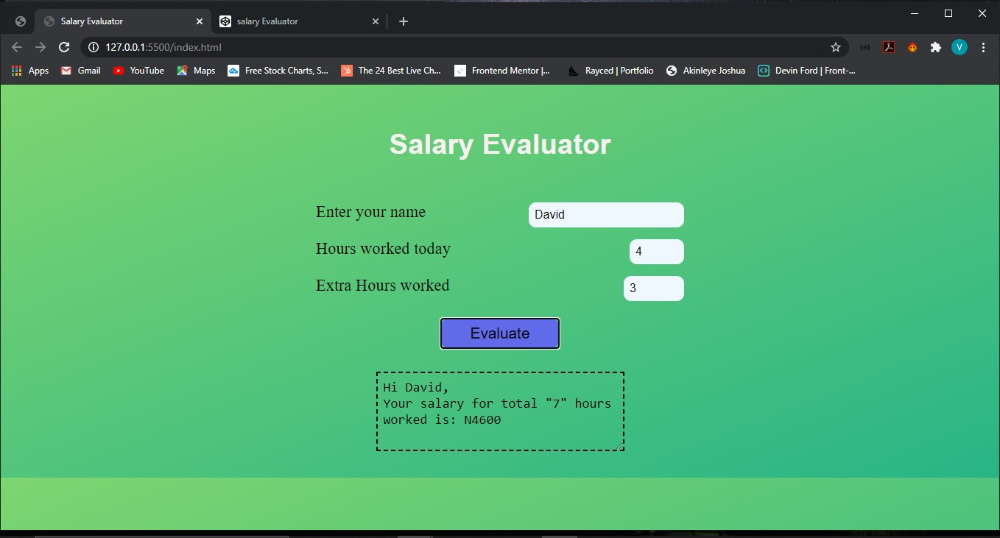

# Salary Evaluator

This salary Evaluator takes input based on *hours worked*. Employee gets paid N1000 every *hour* and a tip of N200 every *extra hour* worked after 4 hours.
#### Here's a link to see the site live via codepen
[Click This link](https://codepen.io/veedjohnson/pen/rNLvadJ)

